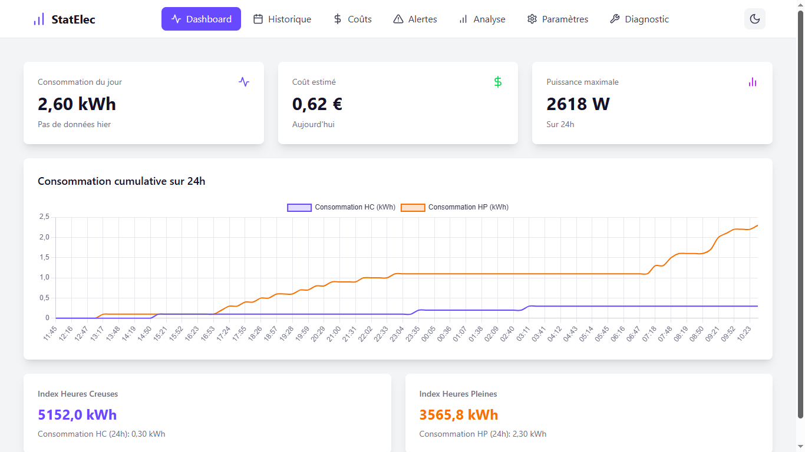

 # Statelec

 Application web de monitoring de consommation électrique développée en PHP avec une architecture MVC moderne.

 

## Fonctionnalités

- **Dashboard** : Vue d'ensemble de la consommation électrique en temps réel
- **Historique** : Consultation des données de consommation passées
- **Coûts** : Analyse des coûts énergétiques
- **Alertes** : Système de notifications et alertes
- **Analyse** : Statistiques et analyses avancées
- **Paramètres** : Configuration de l'application
- **Diagnostic** : Outils de diagnostic système

## Technologies utilisées

- **Backend** : PHP 8.1+ avec architecture MVC
- **Frontend** : Twig templates, Tailwind CSS, JavaScript
- **Base de données** : MySQL/MariaDB
- **Graphiques** : Chart.js
- **Notifications** : Toasts personnalisés
- **Autres** : Composer pour la gestion des dépendances, Dotenv pour la config

## Installation

### Prérequis

- PHP 8.1 ou supérieur
- MySQL/MariaDB
- Composer
- Serveur web (Apache/Nginx)

### Étapes d'installation

1. **Cloner le repository**
   ```bash
   git clone https://github.com/orwelltherazer/statelec.git
   cd statelec
   ```

2. **Installer les dépendances PHP**
   ```bash
   composer install
   ```

 3. **Configuration de la base de données**
    - Créer une base de données MySQL
    - Importer le schéma depuis `db/dump.sql`
    - Configurer les variables d'environnement dans `.env`

4. **Configuration du serveur web**
   - Configurer le DocumentRoot vers le dossier `public/`
   - S'assurer que les URL sont réécrites vers `index.php`

5. **Permissions**
   ```bash
   chmod 755 -R .
   ```

## Configuration

Créer un fichier `.env` à la racine du projet :

```env
DB_HOST=localhost
DB_NAME=statelec
DB_USER=votre_utilisateur
DB_PASS=votre_mot_de_passe
BASE_PATH=/statelec
```

## Utilisation

 ### Collecte de données

 L'application fonctionne avec un module de lecture TIC installé sur le compteur Linky. Ce module transmet les données de consommation électrique vers la plateforme ThingSpeak. L'application peut récupérer ces données automatiquement via l'API ThingSpeak (configuration requise dans les paramètres).

 Les détails de la réalisation du module de collecte des données seront ajoutés prochainement.

 La vérification des alertes se fait via le script cron :
 - `cron/alert_cron.php` : Vérification des seuils d'alerte

### API

L'application expose une API REST pour l'intégration :
- `POST /api/consumption` : Sauvegarde de nouvelles données (avec clé API)
- `GET /api/settings/{key}` : Récupération d'un paramètre
- `POST /api/settings/{key}` : Sauvegarde d'un paramètre
- `GET /api/diagnostic/paginated` : Données paginées pour le diagnostic

**Sécurité API** : Une clé API est requise pour les écritures. Configurez `API_KEY` dans `.env`.

## Structure du projet

```
statelec/
├── public/              # Point d'entrée web
│   ├── index.php       # Routeur principal
│   ├── css/            # Styles CSS
│   ├── js/             # Scripts JavaScript
│   └── .htaccess       # Configuration Apache
├── src/                # Code source PHP
│   ├── Controller/     # Contrôleurs MVC
│   ├── Service/        # Services métier
│   └── Middleware/     # Middlewares
├── templates/          # Templates Twig
│   ├── pages/          # Pages principales
│   ├── components/     # Composants réutilisables
│   └── base.twig       # Template de base
├── cron/               # Scripts de tâches planifiées
├── db/                 # Schémas et données SQL
├── composer.json       # Dépendances PHP
├── .env                # Configuration (clés API, timezone)
├── TODO.md             # Liste des améliorations futures
└── .gitignore         # Fichiers à ignorer
```

## Fonctionnalités avancées

- **Mode sombre/clair** : Thème adaptatif avec persistance
- **Gestion d'erreurs** : Pages d'erreur élégantes pour les pannes de base de données
- **Responsive design** : Interface adaptée mobile et desktop
- **Sécurité** : Protection API avec clé obligatoire, validation des données
- **Internationalisation** : Support des fuseaux horaires configurables
- **Notifications** : Système de toasts pour les retours utilisateur
- **Performance** : Optimisation des requêtes et mise en cache

## Développement

### Scripts disponibles

```bash
# Installation des dépendances
composer install

# Lancement du serveur de développement
php -S localhost:8000 -t public/
```

### Tests

Les tests unitaires et d'intégration peuvent être ajoutés dans un dossier `tests/`.

## Contribution

1. Fork le projet
2. Créer une branche feature (`git checkout -b feature/nouvelle-fonctionnalite`)
3. Commit les changements (`git commit -am 'Ajout nouvelle fonctionnalité'`)
4. Push vers la branche (`git push origin feature/nouvelle-fonctionnalite`)
5. Créer une Pull Request

## Licence

Ce projet est sous licence MIT. Voir le fichier `LICENSE` pour plus de détails.

## Support

Pour toute question ou problème, créer une issue sur GitHub ou contacter l'équipe de développement.